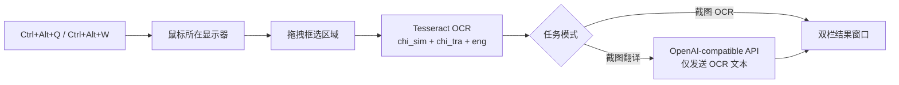

<div align="center">

# Screenshot Translator

**Ubuntu X11 下无需 Python/Conda 的截图翻译与 OCR 托盘工具**

按下快捷键框选屏幕区域；左侧保留截图，右侧显示 OCR 文本或简体中文译文。

[快速开始](#快速开始) · [使用方式](#使用方式) · [自行构建](#自行构建) · [许可证](#许可证)

</div>


## 功能概览

| 模式 | 默认快捷键 | 处理链路 | 右侧输出 |
| --- | --- | --- | --- |
| 截图翻译 | `Ctrl+Alt+Q` | 框选截图 → Tesseract OCR → OpenAI-compatible API | 简体中文译文 |
| 截图 OCR | `Ctrl+Alt+W` | 框选截图 → Tesseract OCR | OCR 原文 |

- 只截取鼠标所在显示器，支持拖拽框选和 `Esc`/右键取消。
- 结果窗口左右分栏，截图等比缩放，文本只读且可选择复制。
- OCR 固定使用 `chi_sim+chi_tra+eng`；翻译时只发送 OCR 文本，截图原图不会上传。
- 设置窗口支持自定义全局快捷键和登录 GNOME 后自动启动。
- 同一时间只处理一个任务，不保存历史、不自动复制或保存截图。

## 工作流



## 快速开始

发布包已包含 Python、PySide6、Qt 和所需动态库；运行时不需要安装或激活 Conda。

### 1. 安装系统 OCR

```bash
sudo apt update
sudo apt install -y \
  tesseract-ocr \
  tesseract-ocr-chi-sim \
  tesseract-ocr-chi-tra \
  tesseract-ocr-eng
```

如果托盘图标不可见，请启用 Ubuntu GNOME 的 AppIndicator 扩展：

```bash
gnome-extensions enable ubuntu-appindicators@ubuntu.com
```

### 2. 解压并运行

```bash
tar -xzf screenshot-translator-linux-x86_64.tar.gz
cd screenshot-translator
./screenshot-translator
```

发布目标固定为 Ubuntu 24.04 x86_64 GNOME X11。Linux 构建受 glibc 版本约束，不承诺兼容更旧发行版；当前不支持 Wayland 或 Windows。

## 使用方式

1. 启动程序并确认托盘图标出现。
2. 按 `Ctrl+Alt+Q` 进入截图翻译，或按 `Ctrl+Alt+W` 进入截图 OCR。
3. 在鼠标所在显示器拖拽框选文字；按 `Esc` 或右键取消。
4. 截图完成后自动打开并复用结果窗口：

```text
┌──────────── 截图翻译 / 截图 OCR ────────────┐
│                                            │
│  截图（等比缩放）    │  译文或 OCR 文本      │
│                      │  只读、可选择复制     │
│                      │                       │
└────────────────────────────────────────────┘
```

## 设置

托盘菜单的“设置…”包含“通用设置”和“翻译接口设置”两个页签。

### 通用设置

- 登录自启动使用 XDG Autostart。打包程序直接记录自身可执行文件，源码模式直接记录当前 Python 与 `app.py`，均不依赖 `conda init`。
- 两个快捷键保存后立即生效；若新快捷键被占用，程序保留旧配置。
- 快捷键必须包含 `Ctrl`、`Alt` 或 `Super`，可附加 `Shift`；主键支持字母、数字和 `F1`–`F12`。
- 自启动文件位于 `~/.config/autostart/screenshot-translator.desktop`。

### 翻译接口设置

| 配置项 | 说明 |
| --- | --- |
| API URL | 完整的 Chat Completions 风格地址，例如 `https://api.example.com/v1/chat/completions` |
| 模型 | 服务端支持的模型名称 |
| API Key | Bearer 密钥 |

三项可以全部留空，但不能只填写一部分。翻译请求读取 `choices[0].message.content`，不绑定厂商 SDK。

- 截图只在本机处理；API 请求只包含 OCR 文本。
- API Key 保存于 Qt 用户配置目录，文件权限为 `0600`，日志不记录密钥。
- 远程接口必须使用 HTTPS；HTTP 仅允许 localhost/回环地址。

## 自行构建

构建依赖 Conda，但生成的 `onedir` 应用不依赖 Conda。项目不会运行 `conda init`。

```bash
cbase
conda activate screenshot-translator
python -m pip install -r requirements-build.txt
./build_app.sh
```

生成物：

```text
dist/
├── screenshot-translator/
│   ├── screenshot-translator
│   ├── _internal/
│   ├── LICENSE
│   └── THIRD_PARTY_NOTICES.md
└── screenshot-translator-linux-x86_64.tar.gz
```

仓库中的 `run.sh` 会优先运行已构建程序；未构建时才使用当前 Python 环境或源码开发环境回退，因此不要求 Shell 已执行 `conda init`。

## 项目结构

```text
.
├── app.py                       # 兼容启动入口与公共符号导出
├── screenshot_translator/       # 按职责拆分的应用代码
│   ├── config.py                # 配置模型、校验与持久化
│   ├── services.py              # OCR、翻译和图片编码
│   ├── desktop.py               # XDG 自启动
│   ├── hotkeys.py               # X11 全局快捷键
│   ├── widgets.py               # 截图、结果和设置界面
│   └── controller.py            # Qt 任务与应用生命周期
├── screenshot-translator.spec   # PyInstaller onedir 配置
├── build_app.sh                 # 构建应用目录和 tar.gz
├── run.sh                       # 独立程序优先、源码开发回退
├── requirements.txt             # 运行依赖
├── requirements-build.txt       # 构建依赖
├── LICENSE                      # 项目 MIT License
└── THIRD_PARTY_NOTICES.md       # 随包第三方许可证说明
```

## 当前限制

- 仅支持 Ubuntu 24.04 x86_64 GNOME X11，不支持跨显示器框选。
- OCR 语言固定为 `chi_sim+chi_tra+eng`，翻译目标固定为简体中文。
- Tesseract 及语言数据由系统提供，不打进应用目录。

## 许可证

项目使用 [MIT License](LICENSE)，版权归 SerendipityOne 所有。PySide6、Qt、PyInstaller 等随包组件的许可信息见 [THIRD_PARTY_NOTICES.md](THIRD_PARTY_NOTICES.md)。Qt/PySide6 按 LGPL 条款使用，动态库保持可替换。
